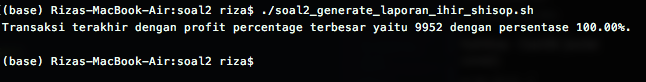
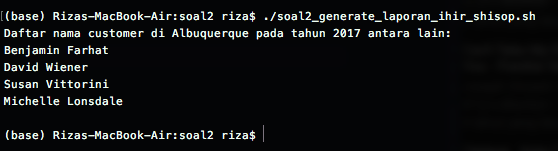
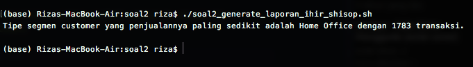
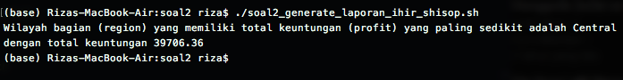
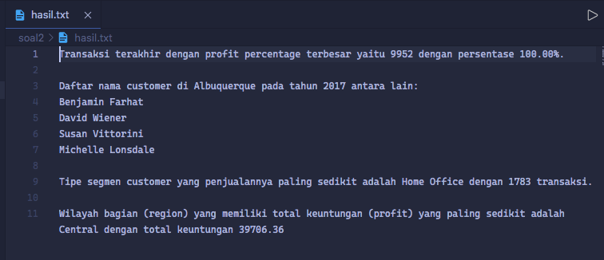
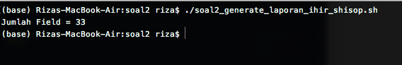
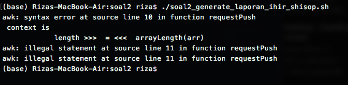

# soal-shift-sisop-modul-1-F10-2021

1.  Ryujin baru saja diterima sebagai IT support di perusahaan Bukapedia. Dia diberikan tugas untuk membuat laporan harian untuk aplikasi internal perusahaan, ticky. Terdapat 2 laporan yang harus dia buat, yaitu laporan daftar peringkat pesan error terbanyak yang dibuat oleh ticky dan laporan penggunaan user pada aplikasi ticky. Untuk membuat laporan tersebut, Ryujin harus melakukan beberapa hal berikut:

    - Mengumpulkan informasi dari log aplikasi yang terdapat pada file syslog.log. Informasi yang diperlukan antara lain: jenis log (ERROR/INFO), pesan log, dan username pada setiap baris lognya. Karena Ryujin merasa kesulitan jika harus memeriksa satu per satu baris secara manual, dia menggunakan regex untuk mempermudah pekerjaannya. Bantulah Ryujin membuat regex tersebut.

    - Kemudian, Ryujin harus menampilkan semua pesan error yang muncul beserta jumlah kemunculannya.

    - Ryujin juga harus dapat menampilkan jumlah kemunculan log ERROR dan INFO untuk setiap user-nya.

      Setelah semua informasi yang diperlukan telah disiapkan, kini saatnya Ryujin menuliskan semua informasi tersebut ke dalam laporan dengan format file csv.

    - Semua informasi yang didapatkan pada poin b dituliskan ke dalam file error_message.csv dengan header Error,Count yang kemudian diikuti oleh daftar pesan error dan jumlah kemunculannya diurutkan berdasarkan jumlah kemunculan pesan error dari yang terbanyak. Contoh:
      Error,Count
      Permission denied,5
      File not found,3
      Failed to connect to DB,2

    - Semua informasi yang didapatkan pada poin c dituliskan ke dalam file user_statistic.csv dengan header Username,INFO,ERROR diurutkan berdasarkan username secara ascending.

            Username,INFO,ERROR
            kaori02,6,0
            kousei01,2,2
            ryujin.1203,1,3

    > Catatan:
    > Setiap baris pada file syslog.log mengikuti pola berikut:

             <time> <hostname> <app_name>: <log_type> <log_message> (<username>)

    > Tidak boleh menggunakan AWK

    ## Penyelesaian nomor 1

    - `Nomor 1a` Scriptnya dapat dilihat [disini](https://github.com/Allam0053/soal-shift-sisop-modul-1-F10-2021/blob/main/soal1/soal1.sh). Berikut adalah penjelasan scriptnya:
      NOTE: Code dibawah ini diambil dengan mempertimbangkan keterkaitan dengan jawaban soal. Bisa jadi code ini memiliki line yang tidak urut pada shell script
      ```shell
      error_count=0
      info_count=0 #a
      error_pattern='ERROR ([[:punct:][:alnum:]]+)'
      while read in_line; do
        if [[ "$in_line" =~ $error_pattern ]]; then
        error_count=$(($error_count+1))
      else
        info_count=$(($info_count+1))
      fi
      done < $in_f
      ```
      jumlah error dan info akan tersimpan pada variable $error_count dan $info_count
    - `Nomor 1b` Scriptnya dapat dilihat [disini](https://github.com/Allam0053/soal-shift-sisop-modul-1-F10-2021/blob/main/soal1/soal1.sh). Berikut adalah penjelasan scriptnya:
      NOTE: Code dibawah ini diambil dengan mempertimbangkan keterkaitan dengan jawaban soal. Bisa jadi code ini memiliki line yang tidak urut pada shell script

      ```shell
      error_kind=("")
      error_kind_sum=(0)
      error_kind_sum_sort=(0)
      error_pattern='ERROR ([[:punct:][:alnum:]]+)'
      while read in_line; do
        if [[ "$in_line" =~ $error_pattern ]]; then
            error_count=$(($error_count+1))
            line=${in_line##*ERROR } #extract string setelah "ERROR"
            kind=${line% (*}
            for i in "${!error_kind[@]}"; do
                if [[ "${error_kind[$i]}" == "$kind" ]]; then
                    error_kind_sum[$i]=$((${error_kind_sum[$i]}+1))
                    flag=0
                    break
                else
                    flag=1
                fi
            done
            if [[ $flag == 1 ]]; then
                error_kind[${#error_kind[@]}]="$kind"
                error_kind_sum[${#error_kind_sum[@]}]=1
            fi
        else
            info_count=$(($info_count+1))
        fi
      done < $in_f

      #sorting
      echo "Error,Count" > $output_file_1
      for i in "${!error_kind_sum[@]}"; do
          if [[ $i == 0 ]]; then
              continue
          fi
          error_kind_sum_sort[${#error_kind_sum_sort[@]}]=${error_kind_sum[$i]}
      done
      error_kind_sum_sort=($(echo ${error_kind_sum_sort[*]}| tr " " "\n" | sort -n)) #-r for descending

      #print
      for ((i=${#error_kind_sum_sort[@]}; i>=1; i=i-1))
      do
          for j in "${!error_kind_sum[@]}"; do
              if [[ $j == 0 ]]; then
                  continue
              fi
              if [[ "${error_kind_sum_sort[$i]}" =~ "${error_kind_sum[$j]}" ]]; then
                  echo "${error_kind[$j]}: ${error_kind_sum[$j]}" #b
                  echo "${error_kind[$j]}: ${error_kind_sum[$j]}" >> $output_file_1 #d
                  continue
              fi
          done
      done
      ```

      Konsep code di atas adalah sebagai berikut:

      - mengiterasi tiap bari input pada loop while
      - tiap jumlah error akan diassign ke variable baru dan variable tersebut akan diurutkan secara descending dengan perintah echo
      - pada loop yang terakhir ini, iterasi dilakukan berdasarkan jumlah error yang telah diurutkan secara descending sebelumnya. dan setiap jumlah error yang sama dengan jumlah error yang telah diurutkan tadi, akan dicetak nama errornya dan jumlah errornya

    - `Nomor 1c` Scriptnya dapat dilihat [disini](https://github.com/Allam0053/soal-shift-sisop-modul-1-F10-2021/blob/main/soal1/soal1.sh). Berikut adalah penjelasan scriptnya:
      NOTE: Code dibawah ini diambil dengan mempertimbangkan keterkaitan dengan jawaban soal. Bisa jadi code ini memiliki line yang tidak urut pada shell script

      ```shell
      error_count=0
      info_count=0 #a
      error_pattern='ERROR ([[:punct:][:alnum:]]+)'
      while read in_line; do
          line=${in_line##*(}
          user=${line%)*}

          for i in "${!user_name[@]}"; do
              if [[ "${user_name[$i]}" == "$user" ]]; then
                  if [[ $in_line =~ "INFO" ]]; then
                      user_info[$i]=$((${user_info[$i]}+1))
                  else
                      user_error[$i]=$((${user_error[$i]}+1))
                  fi
                  flaguser=0
                  break
              else
                  flaguser=1
              fi
          done
          if [[ $flaguser == 1 ]]; then
              user_name[${#user_name[@]}]="$user"
              if [[ $in_line =~ "INFO" ]]; then
                  user_info[${#user_info[@]}]=1
                  user_error[${#user_error[@]}]=0
              else
                  user_info[${#user_info[@]}]=0
                  user_error[${#user_error[@]}]=1
              fi
          fi

      done < $in_f

      #sorting
      for i in "${!user_name[@]}"; do
          if [[ $i == 0 ]]; then
              continue
          fi
          user_string_sort[${#user_string_sort[@]}]="${user_name[$i]},${user_info[$i]},${user_error[$i]}"
      done
      user_string_sort=($(echo ${user_string_sort[*]}| tr " " "\n" | sort -n))

      #print
      echo "Username,INFO,ERROR" > $output_file_2
      for i in "${!user_name[@]}"; do
          if [[ $i == 0 ]]; then
              continue
          elif [[ "${user_string_sort[$i]}" == "" ]]; then
              continue
          fi
          echo "${user_string_sort[$i]}" #c
          echo "${user_string_sort[$i]}" >> $output_file_2 #e
      done
      ```

      Konsep code di atas adalah sebagai berikut:

      - mengiterasi tiap bari input pada loop while, jika pattern nya sesuai dengan pattern log error, maka jumlah error pada user terkait akan dilakukan penjumlahan. Jika pattern nya tidak sesuai dengan pattern log error, maka log info user terkait akan dilakukan penjumlahan
      - tiap nama serta jumlah error dan info akan diassign ke variable baru sebagai string dan variable tersebut akan diurutkan secara ascending dengan perintah echo.
      - pada loop yang terakhir ini, iterasi dilakukan untuk mencetak hasil pengurutan pada operasi sebelumnya

    - `Nomor 1d` Scriptnya dapat dilihat [disini](https://github.com/Allam0053/soal-shift-sisop-modul-1-F10-2021/blob/main/soal1/soal1.sh).
      NOTE: Code 1d sudah terdapat pada 1b
      Konsep code di atas adalah sebagai berikut:
      - mengiterasi tiap bari input pada loop while
      - tiap jumlah error akan diassign ke variable baru dan variable tersebut akan diurutkan secara descending dengan perintah echo
      - pada loop yang terakhir ini, iterasi dilakukan berdasarkan jumlah error yang telah diurutkan secara descending sebelumnya. dan setiap jumlah error yang sama dengan jumlah error yang telah diurutkan tadi, akan dicetak nama errornya dan jumlah errornya
    - `Nomor 1e` Scriptnya dapat dilihat [disini](https://github.com/Allam0053/soal-shift-sisop-modul-1-F10-2021/blob/main/soal1/soal1.sh).
      NOTE: Code 1e sudah terdapat pada 1c
      Konsep code di atas adalah sebagai berikut:
      - mengiterasi tiap bari input pada loop while, jika pattern nya sesuai dengan pattern log error, maka jumlah error pada user terkait akan dilakukan penjumlahan. Jika pattern nya tidak sesuai dengan pattern log error, maka log info user terkait akan dilakukan penjumlahan
      - tiap nama serta jumlah error dan info akan diassign ke variable baru sebagai string dan variable tersebut akan diurutkan secara ascending dengan perintah echo.
      - pada loop yang terakhir ini, iterasi dilakukan untuk mencetak hasil pengurutan pada operasi sebelumnya

  <br>
  <br>

2.  Steven dan Manis mendirikan sebuah startup bernama “TokoShiSop”. Sedangkan kamu dan Clemong adalah karyawan pertama dari TokoShiSop. Setelah tiga tahun bekerja, Clemong diangkat menjadi manajer penjualan TokoShiSop, sedangkan kamu menjadi kepala gudang yang mengatur keluar masuknya barang. Tiap tahunnya, TokoShiSop mengadakan Rapat Kerja yang membahas bagaimana hasil penjualan dan strategi kedepannya yang akan diterapkan. Kamu sudah sangat menyiapkan sangat matang untuk raker tahun ini. Tetapi tiba-tiba, Steven, Manis, dan Clemong meminta kamu untuk mencari beberapa kesimpulan dari data penjualan “Laporan-TokoShiSop.tsv”.

    - Steven ingin mengapresiasi kinerja karyawannya selama ini dengan mengetahui Row ID dan profit percentage terbesar (jika hasil profit percentage terbesar lebih dari 1, maka ambil Row ID yang paling besar). Karena kamu bingung, Clemong memberikan definisi dari profit percentage,

      `Profit Percentage = (Profit Cost Price) 100`

      Cost Price didapatkan dari pengurangan Sales dengan Profit. (Quantity diabaikan).

    - Clemong memiliki rencana promosi di Albuquerque menggunakan metode MLM. Oleh karena itu, Clemong membutuhkan daftar nama customer pada transaksi tahun 2017 di Albuquerque.

    - TokoShiSop berfokus tiga segment customer, antara lain: Home Office, Customer, dan Corporate. Clemong ingin meningkatkan penjualan pada segmen customer yang paling sedikit. Oleh karena itu, Clemong membutuhkan segment customer dan jumlah transaksinya yang paling sedikit.

    - TokoShiSop membagi wilayah bagian (region) penjualan menjadi empat bagian, antara lain: Central, East, South, dan West. Manis ingin mencari wilayah bagian (region) yang memiliki total keuntungan (profit) paling sedikit dan total keuntungan wilayah tersebut.

    - Agar mudah dibaca oleh Manis, Clemong, dan Steven, kamu diharapkan bisa membuat sebuah script yang akan menghasilkan file “hasil.txt” yang memiliki format sebagai berikut:

            Transaksi terakhir dengan profit percentage terbesar yaitu *ID Transaksi* dengan persentase *Profit Percentage*%.

            Daftar nama customer di Albuquerque pada tahun 2017 antara lain:
            *Nama Customer1*
            *Nama Customer2* dst

            Tipe segmen customer yang penjualannya paling sedikit adalah *Tipe Segment* dengan *Total Transaksi* transaksi.

            Wilayah bagian (region) yang memiliki total keuntungan (profit) yang paling sedikit adalah *Nama Region* dengan total keuntungan *Total Keuntungan (Profit)*

    > Catatan:
    > Gunakan bash, AWK, dan command pendukung
    > Script pada poin (e) memiliki nama file ‘soal2_generate_laporan_ihir_shisop.sh

    ## Penyelesaian nomor 2

    - `Nomor 2a` Scriptnya dapat dilihat [disini](https://github.com/Allam0053/soal-shift-sisop-modul-1-F10-2021/blob/main/soal2/soal2_generate_laporan_ihir_shisop.sh#L3). Berikut adalah penjelasan scriptnya:

      - `NR != 1` Men-skip baris 1 karena isinya adalah judul field (bukan data)
      - `currentProfit = calcProfitPercentage($18, $21)` Menghitung profit dengan batuan user-defined function `calcProfitPercentage()`. Pada dasarnya fungsi itu hanya menghitung profit dengan rumus yang sudah diberitahu pada soal
      - `if (currentProfit >= biggestProfit) { biggestProfit = currentProfit id = $1 }`
        Untuk mengecek jika profit yang dihitung sekarang lebih besar/sama dengan dari perhitungan profit sebelumnya. Jika benar maka simpan data `id` nya
      - `printf("Transaksi terakhir dengan profit percentage terbesar yaitu %d dengan persentase %.2f%s.\n\n", id, biggestProfit, "%")`
        Untuk menampilkan `id` dengan profit terbesar dengan format kalimat sesuai soal

      <br>

      > Hasil dari jawaban 2a :

      

    <br>

    - `Nomor 2b` Scriptnya dapat dilihat [disini](https://github.com/Allam0053/soal-shift-sisop-modul-1-F10-2021/blob/main/soal2/soal2_generate_laporan_ihir_shisop.sh#L27). Berikut adalah penjelasan scriptnya:

      - `NR != 1 && $10 == "Albuquerque"` Men-skip baris 1 karena isinya adalah judul field (bukan data) dan memilih baris data yang kolom-10 nya adalah "Albuquerque"
      - `split($3, date, "-")` Untuk kolom-3 (datanya berupa string), pisahkan stringnya berdasarkan karakter "`-`" menjadi array yang disimpan pada variable `date` menggunakan built-in function `split()`
      - `if (date[3] == 17) { requestPush(arr, $7) }`
        Untuk mengecek apakah sekarang tahun 2017. Jika benar maka data (kolom-7) akan disimpan pada array `arr`. `requestPush()` adalah user-defined function yang pada dasarnya fungsi ini melakukan pengecekan sebuah data yang ingin disimpan ke dalam array. Data baru akan disimpan jika dan hanya jika array belum memiliki data baru tersebut.
      -       printf("Daftar nama customer di Albuquerque pada tahun 2017 antara lain: \n")
              for (ie in arr) print arr[ie]
              print " "
        Menampilkan data yang sudah disimpan pada array `arr` dengan format kalimat sesuai pada soal

      <br>

      > Hasil dari jawaban 2b :

      

      <br>

    - `Nomor 2c` Scriptnya dapat dilihat [disini](https://github.com/Allam0053/soal-shift-sisop-modul-1-F10-2021/blob/main/soal2/soal2_generate_laporan_ihir_shisop.sh#L58). Berikut adalah penjelasan scriptnya:

      - `NR != 1` Men-skip baris 1 karena isinya adalah judul field (bukan data)
      -       if ($8 == "Consumer") totalConsumer++
              if ($8 == "Corporate") totalCorporate++
              if ($8 == "Home Office") totalHomeOffice++
        Mengecek jika data kolom-8 sesuai dengan kondisi, maka kemunculannya akan dihitung dengan meng-increment pada variabel terkait.
      - `leastCount = angkaTerkecil3(totalConsumer, totalHomeOffice, totalCorporate)`
        Untuk mencari & menyimpan nilai terkecil dari variabel `totalConsumer`, `totalHomeOffice`, `totalCorporate` dengan bantuan user-defined function `angkaTerkecil3()`.
      -       if (leastCount == totalConsumer) leastSector = "Consumer"
              if (leastCount == totalHomeOffice) leastSector = "Home Office"
              if (leastCount == totalCorporate) leastSector = "Corporate"
        Mengecek untuk menentukan sektor mana yang memiliki kemunculan terkecil.
      - `printf("Tipe segmen customer yang penjualannya paling sedikit adalah %s dengan %d transaksi.\n\n", leastSector, leastCount)`
        Menampilkan segmen penjualan paling sedikit dengan format kaliamt sesuai pada soal.

      <br>

      > Hasil dari jawaban 2c :

      

      <br>

    - `Nomor 2d` Scriptnya dapat dilihat [disini](https://github.com/Allam0053/soal-shift-sisop-modul-1-F10-2021/blob/main/soal2/soal2_generate_laporan_ihir_shisop.sh#L90). Berikut adalah penjelasan scriptnya:

      - `NR != 1` Men-skip baris 1 karena isinya adalah judul field (bukan data).
      -       if ($13 == "Central") totalCentral += $21
              if ($13 == "East") totalEast += $21
              if ($13 == "West") totalWest += $21
              if ($13 == "South") totalSouth += $21
        Menghitung total profit (ada pada kolom-21) berdasarkan daerahnya.
      - `leastProfit = angkaTerkecil4(totalCentral, totalEast, totalWest, totalSouth)`
        Mencari profit terkecil dengan bantuan user-defined function `angkaTerkecil4()`
      -       if (leastProfit == totalCentral) leastRegion = "Central"
              if (leastProfit == totalEast) leastRegion = leastRegion " East"
              if (leastProfit == totalWest) leastRegion = leastRegion " West"
              if (leastProfit == totalSouth) leastRegion = leastRegion " South"
        Menentukan daerah mana yang profitnya paling kecil.
      -       printf("Wilayah bagian (region) yang memiliki total keuntungan (profit) yang paling sedikit adalah %s dengan total keuntungan %.2f\n", leastRegion, leastProfit)
        Menampilkan wilayah & proft dengan profit terkecil sesuai format kalimat pada soal.

      <br>

      > Hasil dari jawaban 2d :

      

      <br>

    - `Nomor 2e` Sudah dilakukan bersamaan dengan poin a, b, c, d pada setiap akhir scriptnya. Detail line scriptnya bisa akses dibawah ini:
      | 2e sudah pada tiap poin soal | Detail line code script |
      | ------ | ------ |
      | 2a | [line 24](https://github.com/Allam0053/soal-shift-sisop-modul-1-F10-2021/blob/main/soal2/soal2_generate_laporan_ihir_shisop.sh#L24) |
      | 2b | [line 55](https://github.com/Allam0053/soal-shift-sisop-modul-1-F10-2021/blob/main/soal2/soal2_generate_laporan_ihir_shisop.sh#L55) |
      | 2c | [line 87](https://github.com/Allam0053/soal-shift-sisop-modul-1-F10-2021/blob/main/soal2/soal2_generate_laporan_ihir_shisop.sh#L87) |
      | 2d | [line 123](https://github.com/Allam0053/soal-shift-sisop-modul-1-F10-2021/blob/main/soal2/soal2_generate_laporan_ihir_shisop.sh#L123) |

      <br>

      > Hasil dari jawaban 2e :

      

      <br>

    - **Error-error** yang sempat terjadi pada nomor 2

      > Bug: dimana seharusnya hanya menampilkan 21 field tetapi disini menampilkan 33 field

      

      Saat itu sempat lupa untuk memberi option `-F"\t"` pada script awk sehingga terjailah bug tersebut.

      Solusinya adalah dengan menambahkan option `-F"\t"` pada script awk.

      > Error: assignment pada reserved name `length`

      

      Ternyata `length` adalah built-in function dari awk untuk menghitung panjang suatu string. Pada saat itu dilakukan assignment value menggunakan nama variabel `length` dan tentu saja hal tersebut menyebabkan error.

      Solusinya simple yaitu hanya perlu mengganti nama variabel dengan nama lain.

    <br>
    <br>

3.  Kuuhaku adalah orang yang sangat suka mengoleksi foto-foto digital, namun Kuuhaku juga merupakan seorang yang pemalas sehingga ia tidak ingin repot-repot mencari foto, selain itu ia juga seorang pemalu, sehingga ia tidak ingin ada orang yang melihat koleksinya tersebut, sayangnya ia memiliki teman bernama Steven yang memiliki rasa kepo yang luar biasa. Kuuhaku pun memiliki ide agar Steven tidak bisa melihat koleksinya, serta untuk mempermudah hidupnya, yaitu dengan meminta bantuan kalian.

## Penyelesaian nomor 3


- 3a. Membuat script untuk mengunduh 23 gambar kucing dari https://loremflickr.com/320/240/kitten, membuat file log Foto.log untuk mencatat log pengunduhannya, menghapus gambar-gambar yang sama, menyimpan gambar kucing tersebut dengan format nama Koleksi_XX
  - [Link kode bash nomor 3a](https://github.com/Allam0053/soal-shift-sisop-modul-1-F10-2021/blob/main/soal3/soal3a.sh)
  - Digunakan loop for untuk mengunduh 23 gambar dari website tertera. Jika urutan unduhan filenya kurang dari 10, maka menggunakan command wget –O Koleksi*0$i sedangkan jika lebih dari atau sama dengan 10, maka menggunakan wget –O Koleksi*$i. Nama folder atau file dapat dibentuk dari variabel
  - Untuk masalah menghapus foto yang memiliki duplikat, belum diketahui cara selain mendownload sebuah service atau mengecek masing-masing pixel satu per satu. Ada ide untuk menggunakan du -h untuk membaca besar memori gambar, tapi masih memfaktorkan adanya perbedaan pada ukuran byte pada dua gambar yang sama
  - File log memasukkan hasil output dari setiap program yang dijalankan, jadi file log Foto.log menerima semua hasil output dari line pertama sampai terakhir ke dalam Foto.log menggunakan &>> karena jika menggunakan >>, maka tidak ada isinya di dalam Foto.log
- 3b. Membuat crontab untuk menjalankan script sehari sekali pada jam 8 malam pada tanggal-tanggal tertentu (Seminggu sekali mulai tanggal 1 dan empat hari sekali mulai tanggal 2). Script yang dijalankan memindah semua gambar serta log-nya ke dalam folder dengan nama tanggal unduhannya
  - [Link kode bash nomor 3b](https://github.com/Allam0053/soal-shift-sisop-modul-1-F10-2021/blob/main/soal3/soal3b.sh)
  - [Link kode crontab nomor 3b](https://github.com/Allam0053/soal-shift-sisop-modul-1-F10-2021/blob/main/soal3/cron3b.tab)
  - Untuk file shell, tidak jauh beda dengan file pada nomor 3a. Perbedaannya adalah letak folder untuk menyimpan unduhannya berupa tanggal dengan format dd-mm-yyyy yang dapat dibuat dengan memasukan string tanggal dengan isi “`date +%d-%m-%Y`” ke dalam direktori folder yang akan dituju (`wget –P ~/”$tanggal”’)
  - Direktori file dapat disingkat menjadi ~/Folder
  - Selain itu, Foto.log juga akan dipindah ke folder “$tanggal”
  - Untuk file crontab, untuk menentukan file (`bash soal3b.sh`) dieksekusi setiap jam 8 malam seminggu sekali mulai dari tanggal 1 dan setiap empat minggu sekali mulai dari tanggal 2 dalam crontab dapat menggunakan format `0 20 _/7,2-31/4 _ \* bash soal3b.sh’
- 3c. Membuat script untuk mengunduh gambar kelinci dari https://loremflickr.com/320/240/bunny dan gambar kucing dari situs di nomor 3a secara bergantian dan disimpan pada folder yang berbeda (Kucing_tanggal dan Kelinci_tanggal)
  - [Link kode bash nomor 3c](https://github.com/Allam0053/soal-shift-sisop-modul-1-F10-2021/blob/main/soal3/soal3c.sh)
  - Untuk dapat membedakan antara hari untuk mengunduh gambar kelinci dan kucing dapat menggunakan waktu UNIX (`date +%s`) yang dibagi oleh 86400 (hasil dari perkalian antara satu menit (60), satu jam (60), dan satu hari (24)). Lalu, hasil pembagian tersebut dicek apakah ganjil atau genap supaya dapat mengunduh gambar kelinci atau kucing secara bergantian menggunakan `if [ $(( $hari % 2)) -eq 0 ]`
  - Format filenya masih mengikuti cara pada soal sebelumnya : menggunakan variabel. Tapi, jika ada spasi di dalam string tersebut, maka variabel tersebut diketik di dalam sebuah tanda petik
- 3d. Membuat script untuk membuat zip sebuah folder yang berisi foto-foto tadi dan membuat password untuk zip tersebut berupa tanggal pembuatan zip
  - [Link kode bash nomor 3d](https://github.com/Allam0053/soal-shift-sisop-modul-1-F10-2021/blob/main/soal3/soal3d.sh)
  - Untuk membuat zip file berpassword, dapat menggunakan `zip –r –P [namapassword] [nama file zip yang akan dibuat] [nama-nama file/folder yang akan dikompres]`. –r akan membaca folder yang akan dimasukan dalam zip sedangkan –P untuk menambahkan password
  - Nama passwordnya memiliki format variabel sama seperti soal-soal sebelumnya, yaitu menggunakan variabel string dari command `date +%d%m%Y`
  - Untuk folder yang akan dizip, saya menamakannya Folder_Gambar yang berisi folder-folder foto-foto kucing dan kelinci
- 3e. Membuat crontab untuk menjalankan script pada 3d setiap hari kerja (Senin sampai Jumat) pada jam 7 pagi. Lalu, diluar waktu tersebut, file zip tadi di-unzip dan file zip tadi dihapus
  - [Link kode crontab nomor 3e](https://github.com/Allam0053/soal-shift-sisop-modul-1-F10-2021/blob/main/soal3/cron3e.tab)
  - Ada dua perintah crontab : menjalankan soal3d.sh untuk membuat file zip dan membuka file zip lalu menghapusnya
  - Perintah pertama akan membuat file zip setiap jam 7 pagi pada hari senin sampai jumat (`0 7 * * 1-5`)
  - Perintah kedua akan mebuka file zip dan mengisinya dengan password yang berupa tanggal. Pada saat yang sama, file Koleksi.zip akan dihapus. Ini terjadi setiap jam 6 sore pada hari senin sampai jumat, dikarenakan pada hari sabtu dan minggu tidak ada kegiatan apa-apa (`0 18 * * 1-5`)
